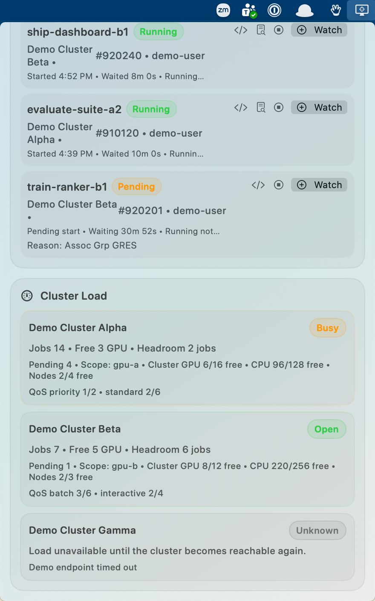
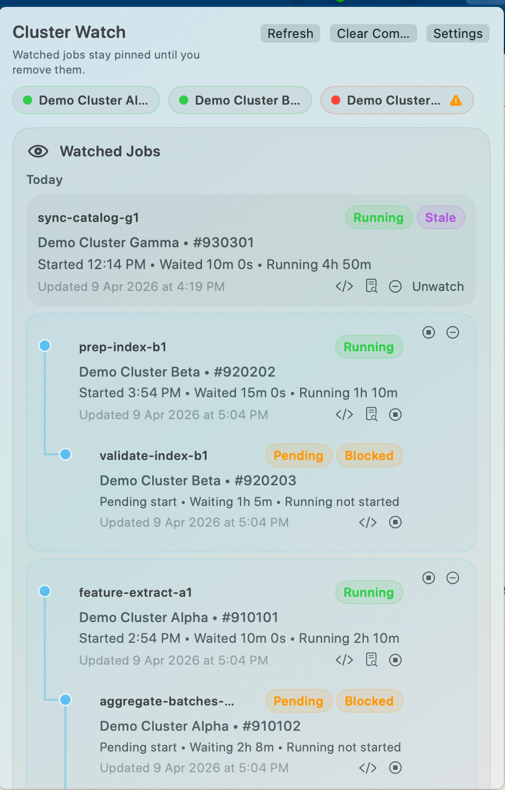

# Cluster Watch

Cluster Watch is a native macOS menu bar app for monitoring Slurm jobs across any number of configured clusters. It keeps watched jobs pinned until you explicitly unwatch them, preserves last-known job state during outages, and sends one local notification when a watched job reaches a terminal state.

<p align="center">
  <a href="img/cw_screenshot_1.png">
    
  </a>
  <a href="img/cw_screenshot_2.png">
    
  </a>
</p>

## Features

- Native SwiftUI menu bar app built with `MenuBarExtra`
- Any number of user-defined clusters, each with:
  - display name
  - SSH alias
  - optional SSH username override
  - optional Slurm owner override
  - enabled/disabled state
- Global username filter seeded from your macOS username, plus optional per-cluster overrides
- Watched jobs grouped into history-style buckets:
  - Today
  - Yesterday
  - Earlier This Week
  - Last Week
  - Older
- Dependency-aware chain rendering in both watched and unwatched sections:
  - dependent jobs are grouped visually into a shared tree
  - grouped chains can be watched or unwatched as a whole
  - chain rows avoid repeating redundant dependency text
- Split job timing into:
  - waiting time from submit to start
  - running time from start to end or now
- Dependency-aware rendering for:
  - jobs waiting on other jobs
  - watched jobs that unblock downstream jobs
  - unsatisfied dependency failures such as `DependencyNeverSatisfied`
- Compact cluster status indicators in the header
- Searchable `Browse Unwatched Jobs` section that excludes already watched jobs
- One-click remote log tail window for jobs with detected Slurm-managed stdout/stderr paths
  - log paths are detected lazily
  - logs are tailed over SSH from the remote cluster
  - `Tail` is only shown for non-pending jobs with detected log files
- One-shot local notifications for terminal transitions
- Persistent local state for watched jobs, cluster settings, and reachability snapshots

## Project Layout

- `Cluster Watch.xcodeproj`
- `Cluster Watch`
  - SwiftUI app entry point, menu bar UI, settings window, `Info.plist`
- `Shared`
  - shared models, parsing, SSH client, persistence, polling, formatting, and store logic
- `Tests/ClusterWatchCoreTests`
  - unit tests intended for the Xcode test target
- `Tools/generate_xcodeproj.rb`
  - reproducible generator for the checked-in Xcode project

## Requirements

- macOS 14 or newer
- Full Xcode only if you want to build the app from source
- Working non-interactive SSH aliases in `~/.ssh/config`
- `squeue` and `sacct` available on the remote cluster login nodes

## SSH Alias Setup

Cluster Watch connects to clusters through your local SSH client, so each cluster should already be reachable with a short alias from Terminal before you add it to the app.

Example `~/.ssh/config`:

```sshconfig
Host cluster-alpha
    HostName login.cluster-alpha.example.edu
    User your-ssh-login
    IdentityFile ~/.ssh/id_ed25519
    IdentitiesOnly yes
    ServerAliveInterval 30

Host cluster-beta
    HostName login.cluster-beta.example.edu
    User your-ssh-login
    IdentityFile ~/.ssh/id_ed25519
    IdentitiesOnly yes
    ServerAliveInterval 30
```

Notes:
- `Host` is the alias you will enter in Cluster Watch
- `User` is optional in the app if it is already set in `~/.ssh/config`
- key-based or agent-based authentication is required
- password prompts and MFA prompts that require interactive terminal input are not supported by the app

Before launching the app, verify each alias manually:

```sh
ssh cluster-alpha
ssh cluster-beta
```

If the cluster requires a specific Slurm environment, also verify these commands work after login:

```sh
squeue --version
sacct --version
```

## App Setup

1. Download the latest release from the GitHub releases page:
   - [Latest release](https://github.com/kdubovikov/cluster-watch/releases/latest)
2. Extract the downloaded zip and open `Cluster Watch.app`.
3. If macOS warns because the app is unsigned, acknowledge the Gatekeeper prompt using your normal macOS workflow for unsigned apps.
4. Find the app icon in the macOS menu bar.
5. Open `Settings`.
6. Add one or more clusters.
7. For each cluster, configure:
   - `Display name`: the label shown in the UI
   - `SSH alias`: the alias from `~/.ssh/config`, such as `cluster-alpha`
   - `SSH username override`: optional, only if you want `user@alias` to differ from your SSH config
   - `Job owner override`: optional, only if the Slurm username to filter on differs from your default username
   - `Enabled`: whether Cluster Watch should poll this cluster
8. Set the global username filter.
9. Adjust the polling interval if the default `30 seconds` is not suitable.
10. Close Settings and use `Refresh` once to confirm the cluster list is working.

If you prefer to build from source instead:

1. Open `Cluster Watch.xcodeproj` in Xcode.
2. Select the `Cluster Watch` scheme.
3. Build and run the app from Xcode.

## First Run Checklist

- Check that each enabled cluster shows as reachable in the header
- Confirm the `Browse Unwatched Jobs` section shows only your jobs by default
- Watch one running or pending job and confirm it appears in the watched section
- If the job is Slurm-managed and has stdout/stderr paths, try the log tail action
- Enable notifications for `Cluster Watch` in `System Settings > Notifications > Cluster Watch` if you want terminal-state alerts

## Usage

1. Open the menu bar app.
2. Review watched jobs at the top of the window.
3. Browse current unwatched jobs in the lower search area.
4. Click `Watch` on a standalone row or use the group action on a dependency chain to watch the whole chain.
5. For running or finished jobs with detected Slurm log paths, click `Tail` to open the remote log tail window.
6. Leave watched jobs pinned after completion, or remove them manually with:
   - `Unwatch` on a single standalone row
   - group unwatch on a dependency-linked watched chain
   - `Clear Completed` for all watched jobs in terminal states

## Slurm Command Assumptions

The app shells out through `/usr/bin/ssh` and expects key or agent based access only. Password prompts are not supported.

Local job-finish notifications also depend on macOS notification permissions. If notifications are disabled for `Cluster Watch` in System Settings, the app can request and schedule notifications but macOS will not display them.

Current jobs are queried with `squeue`, using a machine-readable format similar to:

```sh
ssh mycluster "squeue -h --array -u <username> -o '%i|%u|%T|%j|%V|%S|%M|%E|%r'"
```

Watched jobs that disappear from `squeue` are checked with `sacct`:

```sh
ssh mycluster "sacct -n -P --array -j <jobid> --format=JobIDRaw,User,State,JobName,Submit,Start,End,Elapsed,Reason"
```

The parser prefers the primary row matching the raw/base job ID and ignores step rows such as `.batch` and `.extern`. Dependency data comes from:

- `%E` in `squeue` for remaining dependency expressions
- `%r` in `squeue` for the pending reason
- `Reason` in `sacct` for historical dependency-related failures such as `DependencyNeverSatisfied`

Log path detection and tailing use Slurm metadata when available:

```sh
ssh mycluster "scontrol show job <jobid>"
ssh mycluster "sacct -n -P --array --expand-patterns -j <jobid> --format=JobIDRaw,StdOut,StdErr,WorkDir"
```

When a log path is available, the app tails the remote file with SSH using a command equivalent to:

```sh
ssh mycluster "tail -n 200 -- <remote-log-path>"
```

This means the log tail window reads the file on the remote cluster. If Slurm reports a future stdout/stderr path for a pending job but the file has not been created yet, the app does not expose `Tail` until the job is no longer pending.

## Troubleshooting

- If a cluster shows as unreachable, first verify `ssh <alias>` still works in Terminal.
- If a cluster is reachable but no jobs appear, check the username filter and any per-cluster job owner override.
- If a cluster works in Terminal but not in the app, confirm the alias in Settings exactly matches the `Host` entry in `~/.ssh/config`.
- If job notifications do not appear, confirm notifications are enabled in macOS System Settings and remember that alerts are only sent once per watched job transition to a terminal state.
- If log tailing opens but shows no file yet, the job may still be pending or may not have created the Slurm-managed log file yet.

## Persistence And Outages

- State is saved to:
  - `~/Library/Application Support/ClusterWatch/state.json`
- If a cluster becomes unreachable:
  - watched jobs for that cluster remain visible
  - their last-known state is preserved
  - they are marked stale
- When the cluster becomes reachable again, the app refreshes those jobs in place

## Verification Notes

- The shared core compiles locally with:

```sh
swift build
```

- The manual app bundle can be rebuilt and launched locally with:

```sh
./Tools/build_manual_app.sh
```

- `swift test` may still require a full Xcode developer directory with the Xcode license accepted.
